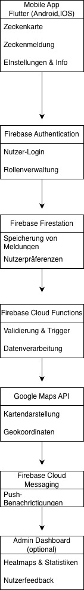

# Realisierungskonzept

## 1. Ziel der Applikation
TickOff ist eine mobile Applikation, die Nutzer in der Schweiz dabei unterstützt, Zeckenrisiken zu erkennen, Zeckenfunde zu melden und Präventionsmassnahmen zu ergreifen.  

### Ziele:
- **Gesundheitsschutz:** Risiko von FSME- und Borreliose-Infektionen durch Aufklärung und Warnsystem verringern.  
- **Community-Datenbank:** Aufbau einer anonymisierten Karte mit Zecken-Hotspots durch Nutzerbeiträge.  
- **Mehrsprachigkeit:** Deutsch, Englisch und Französisch, um Touristen und Einheimische gleichermassen anzusprechen.  
- **Einfache Nutzung:** Fokus auf eine minimalistische, verständliche Benutzeroberfläche (UX-first).  

---

## 2. Komponenten & Architektur

### Hauptkomponenten
1. **Frontend (Mobile App)**
   - Framework: Flutter (Dart)
   - Plattformen: iOS, Android, Web (optional)
   - Hauptfunktionen:
     - Zeckenkarte (Google Maps API)
     - Zecke melden (mit Standort & Zeit)
     - Einstellungen & Info (Sprache, Erste Hilfe, Datenschutz)

2. **Backend**
   - Cloud-Lösung: Firebase
   - Funktionen:
     - Speicherung & Verwaltung von Zeckenmeldungen (Firestore DB)
     - Authentifizierung & Autorisierung
     - Push-Benachrichtigungen
     - Analyse & Monitoring (Firebase Analytics)

3. **API-Integrationen**
   - **Google Maps API:** Kartendarstellung & Geokoordinaten  
   - **Health APIs / Behördenfeeds:** Zeckengefahrenzonen (optional)  
   - **Firebase Cloud Messaging:** Push Notifications  

4. **Admin Dashboard (optional, Web-basiert)**
   - Übersicht über Meldungen & Heatmaps  
   - Zugriff auf Statistiken & Nutzerfeedback  

### Architekturübersicht

Die App verwendet eine Client-Cloud-Architektur, bei der die Geschäftslogik hauptsächlich auf dem Client und einfache Logik im Backend (Firebase Functions) läuft.

---

## 3. Technologiestack

| Schicht | Technologie | Beschreibung |
|----------|--------------|---------------|
| Frontend | Flutter (Dart) | Cross-Plattform Framework |
| Backend | Firebase | NoSQL-DB, Auth, Functions, Hosting |
| Authentifizierung | Firebase Auth + OAuth2 | Anmeldung via Google/Apple |
| Kartenservice | Google Maps API | Darstellung von Zecken-Hotspots |
| Analyse | Firebase Analytics | Nutzerverhalten & Datenfluss |
| Versionskontrolle | GitHub | Codeverwaltung & CI/CD |
| Pipeline | GitHub Actions | Build, Test, Deployment |

---

## 4. Datenmodell & Datenfluss

### Datenfluss
1. Nutzer öffnet App → Standortfreigabe aktivieren.  
2. App ruft Google Maps + vorhandene Meldungen aus Firestore ab.  
3. Nutzer meldet eine Zecke → Daten anonymisiert in Firestore gespeichert.  
4. Backend aktualisiert Hotspot-Karte in Echtzeit.  
5. Push-Notification an Nutzer in betroffenen Regionen.  

### Datenschutz (DSGVO & ISDS)
- Keine personenbezogenen Daten werden gespeichert.  
- Standortdaten werden **nur bei aktiver Meldung** erfasst.  
- Daten werden verschlüsselt (AES-256, HTTPS).  
- Nutzer kann Standortfreigabe jederzeit deaktivieren.  
- Hosting in EU/CH-konformen Rechenzentren (Firebase EU-Region).  

---

## 5. Authentifizierung & Sicherheit

### Authentifizierung & Autorisierung
- Anonyme Anmeldung (Firebase Auth Anonymous) oder Google/Apple Login (OAuth2).  
- Keine Pflichtregistrierung erforderlich, um Zecken zu melden.  
- Zugriffskontrolle über Firebase Security Rules.  

### Datenverschlüsselung
- **In Ruhe (at rest):** AES-256 Standard in Firestore.  
- **Während Übertragung:** TLS 1.3 (HTTPS).  

### Sicherheitsrichtlinien
- Regelmässige Penetrationstests (jährlich).  
- Security Review bei jedem Major Release.  
- Automatisierte Sicherheitsprüfungen über GitHub Dependabot.  
- Backup alle 24 Stunden.  
- Notfallplan (Disaster Recovery) über Firebase Export & GitHub Backup.  

---

## 6. UI/UX Design

### Interface-Skizze (Beschreibung)
- **Startansicht:** Karte mit farbigen Hotspots (Grün, Orange, Rot).  
- **Melden-Button:** zentriert am unteren Rand.  
- **Einstellungen:** Zugriff auf Sprache, Tipps, Datenschutz.  
- **Info-Seite:** Erste-Hilfe-Anleitung mit Icons & Bildern.  

### Gestaltung
- **Farben:**  
  - Grün (#4CAF50): Sicherheit, Natur  
  - Rot (#F44336): Gefahr (Hotspot)  
  - Weiss & Grau: Neutralität und Lesbarkeit  

- **Typografie:**  
  - Sans Serif (Roboto / Open Sans)  
  - Klare Hierarchie (H1 für Titel, H2 für Untertitel, Body für Text)  

---

## 7. Projektorganisation & Ressourcen

| Rolle | Name | Aufgabe |
|--------|------|----------|
| Product Owner | Sebastian | Konzept, Koordination |
| Frontend-Entwickler | Tharun | Flutter UI & Logik |
| Backend-Entwickler | Luca | Firebase & API |
| Tester | Terence | QA, Bugreporting |
| Designer | Team gemeinsam | UI/UX, Icons, Layout |

---

## 8. Zeitplan & Meilensteine

| Phase | Zeitraum | Meilenstein |
|--------|-----------|-------------|
| Konzept & Design | Monat 1–2 | Wireframes, Architektur |
| Entwicklung MVP | Monat 3–5 | Karte, Meldung, DB-Anbindung |
| Testphase (Pilot) | Monat 6 | 20 Testnutzer, Feedback |
| Beta-Launch | Monat 7–8 | Mehrsprachigkeit, Stabilität |
| Öffentliches Release | Monat 9 | App Store Veröffentlichung |
| Wartung & Updates | Ab Monat 10 | Regelmässige Feature-Updates |

---

## 9. Risikoanalyse 

# 7. Technische Risikoanalyse

| ID | Risikobeschrieb | Auswirkung | EW | A | RZ | Analyse / Handlung | Massnahme / Erläuterung | Analyse nach Massnahme | EW | A | RZ | Handlung |
|----|------------------|-------------|----|---|----|--------------------|--------------------------|------------------------|----|---|----|-----------|
| R1 | **Ausfall von Firebase-Diensten** | App kann keine Daten abrufen oder speichern, wodurch Meldungen verloren gehen oder Karte leer bleibt. | 3 | 3 | M | **Risikominderung** | Nutzung von Firebase Status-Monitor, automatisches Backup der Datenbank alle 24h, Failover-System vorbereitet. | | 2 | 2 | T | **Risiko wird akzeptiert** |
| R2 | **Fehlerhafte Karten-API** | Karte wird nicht geladen, Nutzer können keine Hotspots sehen. | 2 | 3 | M | **Risikominderung** | Caching letzter Kartenansicht (Offline-Modus), Anzeige eines Warnhinweises mit Offline-Fallback. | | 2 | 2 | T | **Risiko wird akzeptiert** |
| R3 | **Datenleck oder DSGVO-Verstoss** | Verlust von Vertrauen, rechtliche Konsequenzen, Bussgelder. | 2 | 4 | M | **Risikominderung** | Speicherung nur anonymisierter Daten, AES-Verschlüsselung, Standort nur temporär. | | 1 | 3 | T | **Risiko wird akzeptiert** |
| R4 | **Ausfall von Teammitgliedern (Krankheit)** | Verzögerung im Entwicklungs- oder Testprozess. | 3 | 2 | M | **Risikominderung** | Code wird täglich gepusht (GitHub), alle Dokumentationen sind im Team geteilt. | | 2 | 2 | T | **Risiko wird akzeptiert** |
| R5 | **Fehlerhafte Benutzerakzeptanz (zu komplexe UI)** | Nutzer verstehen App nicht, verwenden sie nicht weiter. | 3 | 3 | M | **Risikominderung** | Frühzeitige Usability-Tests mit Testnutzern, UI-Feedback direkt in der App. | | 2 | 2 | T | **Risiko wird akzeptiert** |
| R6 | **Sicherheitslücke im Code oder API-Zugriff** | Manipulation von Daten, unautorisierte Zugriffe möglich. | 2 | 4 | M | **Risikominderung** | Code Review, Security Rules in Firebase, automatische Abhängigkeitsprüfung via Dependabot. | | 1 | 3 | T | **Risiko wird akzeptiert** |
| R7 | **Kosten für API oder Hosting steigen stark an** | Betriebskosten steigen, Freemium-Modell wird unrentabel. | 2 | 3 | M | **Risikominderung** | Überwachung der API-Nutzung, Wechseloption auf alternative Kartenanbieter. | | 2 | 2 | T | **Risiko wird akzeptiert** |

---

## 7.1 Legende

| Kürzel | Bedeutung | Werte |
|---------|------------|--------|
| **EW** | Eintrittswahrscheinlichkeit | 1 = kaum vorstellbar · 2 = unwahrscheinlich · 3 = wahrscheinlich · 4 = hohe Wahrscheinlichkeit · 5 = sehr hohe Wahrscheinlichkeit |
| **A** | Auswirkungsgrad | 1 = unbedeutend · 2 = gering · 3 = erheblich · 4 = kritisch |
| **RZ** | Risikozahl (EW × A) | 1–3 = Tief · 4–9 = Mittel · 10–20 = Hoch |

---

## 10. Wartungsplan

- Monatliche Funktionsupdates und Bugfixes.  
- Jährliche Sicherheitsüberprüfung.  
- Monitoring über Firebase Analytics.  
- Feedback-System im App-Menü integriert.  
- Versionierung via GitHub (Release Branches).  

---

## 11. Supportstruktur

- **Support-Kanal:** In-App Formular (Feedback).  
- **SLA (Service-Level-Agreement)-Ziel:** Antwort innerhalb von 48 Stunden.  
- **On-Call-Support:** Nur bei kritischen Ausfällen (über Firebase Alerts).  
- **Monitoring:** Automatisierte Fehlerlogs (Crashlytics).  

---

## 12. Release-Management

- **Release-Zyklus:** alle 2 Monate (Minor), alle 6 Monate (Major).  
- **Build & Deploy:** automatisiert über GitHub Actions CI/CD.  
- **Beta-Version:** über TestFlight (iOS) und Google Play Console (Android).  
- **Versionierung:** Semantic Versioning (v1.0.0).  

---

## Fazit
Das Realisierungskonzept von *TickOff* kombiniert eine einfache, zugängliche App-Architektur mit hohen Datenschutz- und Sicherheitsstandards.  
Durch den modularen Aufbau, den Einsatz von Flutter und Firebase sowie eine klare Projektorganisation ist das Projekt technisch, organisatorisch und wirtschaftlich realisierbar.
